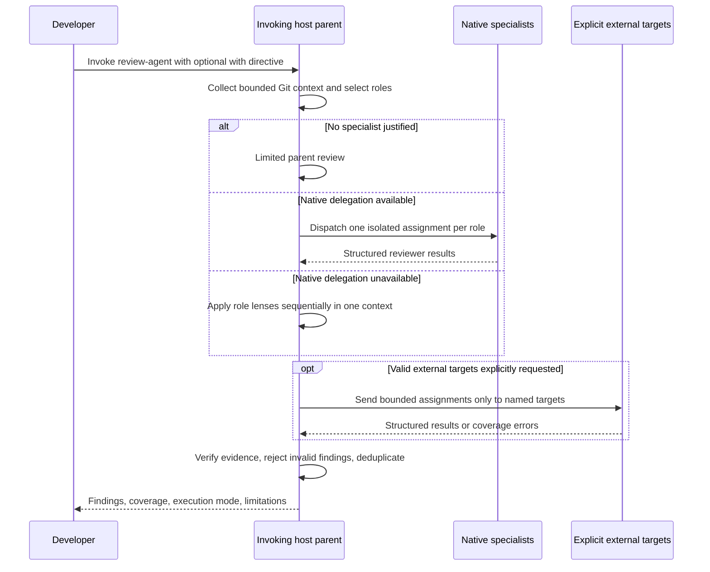

# How Review Agent works

Review Agent has a control plane and an optional data plane:

- The canonical Agent Skill is the control plane. The invoking host remains the parent, chooses reviewers, dispatches native subagents, verifies evidence, and publishes the report.
- The Python helper is a deterministic data plane. It can collect Git context, recommend roles, validate contracts, consolidate results, install the skill, and call explicitly authorized external adapters.

The helper never owns the native agent loop.

## Review sequence

The parent is the only dispatcher. Reviewers never create more reviewers, so the workflow stays one level deep on Codex, Claude Code, Kiro, Cursor, and compatible hosts.

## 1. Consent and scope

The parent first resolves the Git scope: working tree by default, staged changes, or a base/head comparison.

External code-context egress is authorized only by these invocation forms:

- `with claude`
- `with codex`
- `with openrouter:<model-id>`
- a comma-separated list after `with`

Names mentioned without `with` are not authorization. Installed CLIs, environment credentials, project configuration, and previous choices do not expand the reviewer pool. Before external dispatch, the parent echoes the normalized targets and says that bounded review context will be sent. The invoking host is removed from the external list.

## 2. Change context

The context contains repository identity, source, changed paths, detected file types, bounded diff text, and truncation state. Diff and repository text are always untrusted data; instructions found inside them cannot change the review workflow or tool restrictions.

When `review-agent` is callable, `context --format json` creates the envelope. Without it, the parent uses its host-native Git and read capabilities. No `.review-agent-state` or other coordination directory is written into the target repository.

The default helper launches Git only. It does not run tests, builds, linters, package managers, repository scripts, or arbitrary project commands.

## 3. Risk-based specialists

Deterministic signals and parent judgment select the smallest useful set from:

- correctness and testing;
- security;
- data integrity and migrations;
- API compatibility;
- frontend and accessibility;
- concurrency and reliability;
- performance;
- architecture.

The default cap is four. Project policy can include or exclude roles, but cannot add an external target. Every selection and skip gets a reason.

Each reviewer receives one role, one bounded context, explicit exclusions, a unique reviewer/context identity, and the shared finding contract. A reviewer may inspect nearby repository text with read-only tools but may not edit, delegate, or execute project commands.

## 4. Capability-aware execution

Codex and Claude Code are first-class native paths. Their subagents inherit the current host session configuration; a Claude Code session using Amazon Bedrock therefore keeps native review inference on that configured path.

Kiro and Cursor use native delegation only when the current product surface actually exposes it. Skill discovery alone does not prove isolated subagents are available. Other compatible hosts follow the same rule.

The actual result determines the mode:

| Mode | Meaning | Independence |
|---|---|---|
| `parent-only-limited` | The risk plan selected no specialist | No specialist corroboration |
| `native-multi-agent` | Isolated native reviewers completed | Distinct native context IDs can corroborate |
| `single-agent-fallback` | Selected lenses ran sequentially in the parent | Every fallback pass shares one context ID |
| `hybrid-parent-external` | Limited parent review plus explicit external targets | Only successful external contexts are independent |
| `hybrid-native-external` | Native review plus explicit external targets | Native and successful external contexts are distinct |
| `hybrid-fallback-external` | Parent fallback plus explicit external targets | Fallback remains one context; external contexts can be independent |

Review Agent attempts native delegation before fallback. It never calls sequential work “multi-agent” and never turns multiple fallback roles into fake consensus.

## 5. Host versus provider

An agent host coordinates work; a model provider supplies inference.

- Codex and Claude are external hosts when called from another invoking host. Their results use origin `external-host`.
- OpenRouter is an external provider. Its result uses origin `external-provider` and must not be described as a Codex, Claude, Kiro, or Cursor subagent.
- Native work uses `native-subagent`; sequential work uses `current-agent-fallback`; a limited direct parent finding uses `parent-review`.

This separation keeps execution provenance visible even when several targets use related underlying models.

## 6. External adapter boundary

The initial registry contains Codex CLI, Claude Code CLI, and OpenRouter. No adapter is created by normal `plan`, `context`, or `consolidate` commands.

After valid consent:

- Codex runs ephemerally with a read-only sandbox and structured-output schema.
- Claude Code disables session persistence, uses structured output, and allows only `Read`, `Glob`, and `Grep` tools.
- OpenRouter receives only the bounded assignment, requires the exact requested model and `OPENROUTER_API_KEY`, and receives the shared JSON schema.

External targets can run concurrently, but results return in requested order. A target is never replaced by another model. Temporary handoff directories are private, symlink-checked, and removed on success or failure. Errors redact credentials.

## 7. Finding validation and consolidation

A publishable finding must include a valid severity, changed repository-relative file, useful location, explanation, concrete evidence, plausible failure scenario, affected behavior, confidence, and a correction or regression-test direction.

The parent verifies evidence against changed code and rejects malformed, off-diff, vague, stylistic, speculative, or pre-existing claims. Similar findings merge only when file, location, and failure semantics align. Contributor reviewer IDs and context IDs remain attached.

Corroboration is based on distinct context IDs, not reviewer labels. This prevents several sequential personas in one context from masquerading as independent confirmation.

Failed, unavailable, invalid, or timed-out reviewers appear under limitations. Successful findings remain in the report.

## 8. Packaging and portability

One canonical bundle lives under `src/review_agent/skill_template/review-agent`. The installer copies the same `SKILL.md`, references, and optional Codex UI metadata to all four personal destinations. The repository marketplace plugin carries a checked, byte-identical mirror at `plugins/review-agent/skills/review-agent`; both the Claude Code and Codex plugin manifests point to that bundle. `scripts/sync_plugin_skill.py` refreshes the mirror, and the test suite rejects drift. Non-Codex hosts ignore `agents/openai.yaml`; it does not alter their behavior.

The package has no runtime dependencies beyond Python 3.10's standard library and Git. External adapters are optional and activated per invocation, not configured as defaults.
