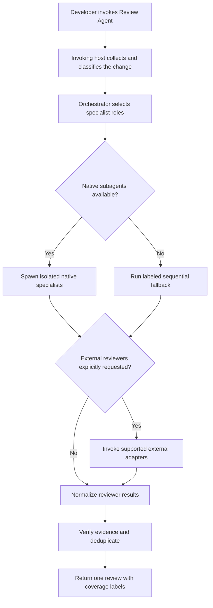
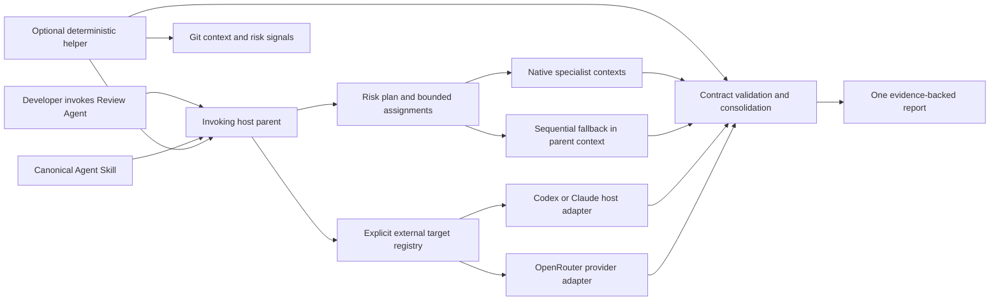
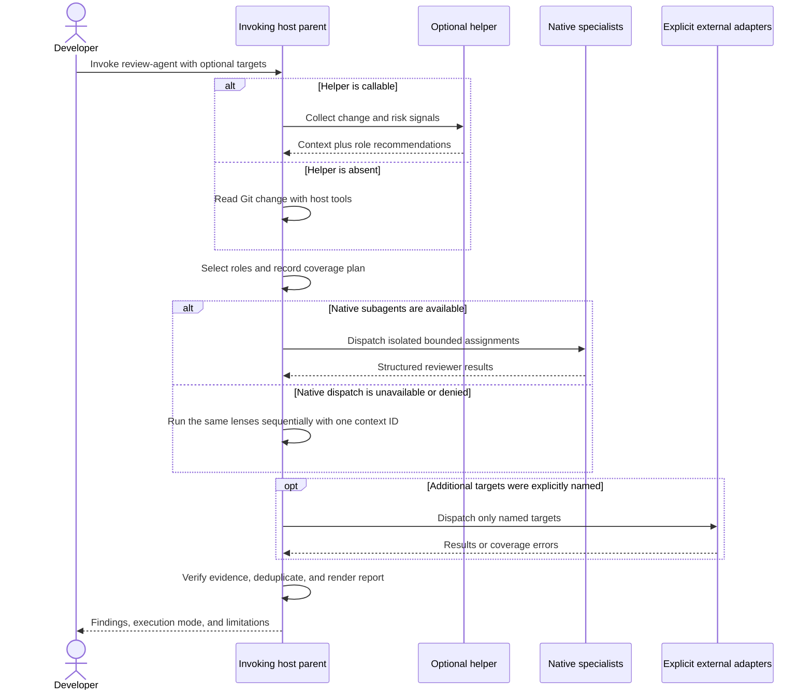
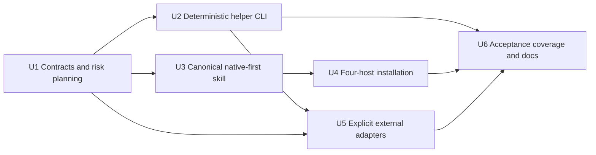

# Portable Review Orchestrator - Plan

## Goal Capsule

- **Objective:** Deliver one portable review skill that orchestrates specialist reviewers inside the agent where it is invoked, while allowing explicitly requested external reviewers as an optional extension.
- **Product authority:** The invoking developer controls whether review stays inside the current host or expands to named external hosts or providers.
- **Open blockers:** None.
- **Execution profile:** Deep, repository-wide replacement of the unreleased provider-first prototype. Implement the native path before optional external adapters.
- **Stop conditions:** Stop if a change would require a hosted service, repository credentials, automatic project-command execution, or a host-specific skill fork that changes the canonical behavior contract.
- **Tail ownership:** The executor owns code, tests, package verification, documentation, and temporary-install smoke tests. Publishing, global skill replacement, commits, pushes, and releases require separate user direction.

---

## Product Contract

### Summary

Review Agent will ship as one canonical skill that keeps the invoking host in control, selects bounded reviewer roles, uses native subagents when available, and labels sequential fallback honestly. The Python package becomes an optional deterministic helper and explicit external-adapter surface instead of the orchestrator.

### Problem Frame

The earlier prototype made Codex-plus-Claude execution the center of the product. That made the workflow depend on which command-line clients happened to be installed, while obscuring the more valuable behavior: dynamically choosing specialists, keeping their contexts isolated, and consolidating their evidence.

Developers already work from different agent hosts and model backends. A Codex user should not need Claude, and a Claude Code user running through Amazon Bedrock should not need Codex or direct Anthropic access. Installing additional tools should create optional capabilities, not silently change the default review path.

### Key Decisions

- **Orchestration first, model diversity second.** (session-settled: user-directed — chosen over Codex-plus-Claude as the default product: specialist-agent behavior matters more than provider diversity.) Governs R4-R12.
- **The invoking host owns default execution.** (session-settled: user-directed — chosen over automatically using every installed agent: the default should preserve the user's current host and model configuration.) Governs R2, R5, R6, R14.
- **Graceful fallback preserves universal use.** (session-settled: user-directed — chosen over refusing to run without genuine subagents: the workflow should remain useful on hosts with weaker capabilities.) Governs R7, R8.
- **Cross-host and cross-provider review is explicit.** (session-settled: user-directed — chosen over implicit multi-model execution: additional reviewers are a requested bonus, not a hidden default.) Governs R13-R16.
- **A portable skill remains the primary product surface.** (session-settled: user-approved — chosen over a provider-centric standalone runner: developers want one invocation inside their existing agent workflow.) Governs R1-R3, R17-R19.

### Actors

- A1. **Developer:** Invokes the review skill and optionally names additional reviewer targets.
- A2. **Invoking host:** Codex, Claude Code, Kiro, Cursor, or another compatible coding agent that plans and coordinates the review.
- A3. **Native specialist:** An isolated reviewer spawned through the invoking host's own subagent capability.
- A4. **External reviewer:** An explicitly requested agent host or model provider reached through an optional adapter.
- A5. **Current-agent fallback:** The invoking host performing focused review passes sequentially when isolated subagents are unavailable.

### Requirements

**Portable invocation**

- R1. The product must provide one canonical review skill that compatible hosts can discover and invoke through their normal skill interface.
- R2. The normal workflow must run from the developer's current IDE or terminal agent session without requiring a separate service.
- R3. The workflow must review Git changes without restricting the target repository to a particular programming language or framework.

**Native orchestration**

- R4. The invoking host must inspect the change, assess affected risk areas, and select only the specialist roles justified by that change.
- R5. The invoking host must act as the parent orchestrator for the complete run.
- R6. By default, selected specialists must use the invoking host's native subagent mechanism and current model/provider configuration.
- R7. When native subagents are unavailable, disabled, or denied, the workflow must complete the selected review roles sequentially in the current agent.
- R8. A sequential fallback must be visibly labeled and must not be represented as independent corroboration or parallel review.
- R9. Native specialists must receive isolated, bounded assignments and return findings through one shared structured contract.
- R10. The orchestrator must wait for required reviewer results, preserve partial results when one reviewer fails, and report incomplete coverage.

**Review behavior**

- R11. Specialist selection must be risk-based rather than running every available reviewer on every change.
- R12. The final result must verify evidence, reject vague speculation, merge duplicates, normalize severity and confidence, and present one coherent review.
- R13. Every publishable finding must identify concrete code evidence, a plausible failure scenario, affected behavior, and a useful correction or regression-test direction.

**Optional external reviewers**

- R14. Merely installing more agent tools must not change the default reviewer pool; unspecified runs use only the invoking host.
- R15. A developer must be able to explicitly add supported external agent hosts or model providers to a run.
- R16. External reviewers must use the same assignment and finding contracts as native specialists, while the report identifies which work was native, external, or fallback.
- R17. An unavailable external target must yield a clear partial-coverage result rather than silently selecting another provider or failing the successful native review.
- R18. Agent hosts and model providers must remain distinct concepts: a host coordinates agents, while a provider supplies model inference.

**Simplicity and control**

- R19. The core workflow must not require Docker, a database, a hosted server, or an always-running daemon.
- R20. Any packaged helper must be limited to deterministic work such as Git change collection, context packaging, schema validation, and result consolidation; it must not replace the host as orchestrator.
- R21. The product must work with useful zero-configuration defaults and allow optional project policy without requiring provider credentials in repository files.
- R22. Reviewers must remain read-oriented by default and must not edit the repository or execute arbitrary project commands as part of the baseline review.

### Review Flow



### Key Flows

- F1. Codex-native review
  - **Trigger:** A developer invokes the skill from Codex in an IDE or terminal.
  - **Actors:** A1, A2, A3
  - **Steps:** Codex plans the review, spawns selected Codex subagents, gathers their findings, and synthesizes the result.
  - **Outcome:** A native multi-agent report using the current Codex model/provider configuration when at least one specialist is selected; otherwise the report uses the limited parent-only mode required by AE7.
  - **Covers:** R1-R6, R9-R13
- F2. Claude Code through Bedrock
  - **Trigger:** A developer invokes the skill from Claude Code configured to use Amazon Bedrock.
  - **Actors:** A1, A2, A3
  - **Steps:** Claude Code remains the orchestrator and spawns Claude Code subagents that inherit the active model configuration.
  - **Outcome:** A native multi-agent report whose inference stays on the configured Bedrock path.
  - **Covers:** R1-R6, R9-R13, R18
- F3. Multiple installed hosts with no external selection
  - **Trigger:** A developer invokes the skill while Codex, Claude Code, or other supported tools are also installed.
  - **Actors:** A1, A2, A3
  - **Steps:** The invoking host runs its native workflow and ignores unrequested external installations.
  - **Outcome:** Predictable current-host-only review.
  - **Covers:** R6, R14
- F4. Explicit hybrid review
  - **Trigger:** A developer invokes the skill and names one or more supported external hosts or providers.
  - **Actors:** A1-A4
  - **Steps:** The invoking host runs its native specialists, dispatches explicitly requested external reviewers, then consolidates every successful result.
  - **Outcome:** One report that preserves reviewer origin and incomplete coverage.
  - **Covers:** R15-R18
- F5. Host without subagent capability
  - **Trigger:** The invoking host cannot spawn isolated subagents.
  - **Actors:** A1, A2, A5
  - **Steps:** The host executes the selected specialist lenses sequentially and applies the normal evidence and consolidation rules.
  - **Outcome:** A useful report labeled as a single-agent fallback.
  - **Covers:** R7-R13

### Acceptance Examples

- AE1. **Covers R4-R6, R14.** Given Codex in VS Code with Review Agent installed, when the developer invokes the skill without external targets, then Codex spawns the selected Codex specialists and does not invoke Claude Code even if it is installed.
- AE2. **Covers R4-R6, R18.** Given Claude Code in VS Code configured through Amazon Bedrock, when the developer invokes the skill without external targets, then Claude Code coordinates its own subagents using the active Bedrock-backed model configuration.
- AE3. **Covers R14.** Given both Codex and Claude Code are installed, when Review Agent is invoked from either host without an external selection, then only that invoking host participates.
- AE4. **Covers R15-R17.** Given Review Agent is invoked with Codex and Claude Code explicitly selected, when one external adapter is unavailable, then the native review succeeds and the report names the missing external coverage.
- AE5. **Covers R1, R6-R8.** Given a compatible Kiro or Cursor installation, when its native subagent capability is available, then the skill uses it; when it is unavailable, the skill returns the labeled sequential fallback instead.
- AE6. **Covers R15-R18.** Given an OpenRouter model is explicitly selected, when the adapter succeeds, then its isolated findings join the report as provider-backed review rather than being described as a Kiro, Cursor, Codex, or Claude subagent.
- AE7. **Covers R11.** Given a low-risk documentation-only change, when the planner finds no justified specialist roles, then the workflow avoids spawning a full reviewer roster and explains the limited review scope.
- AE8. **Covers R19-R22.** Given a newly cloned project with Git and a compatible agent host, when the developer invokes the skill, then the default review requires no container, service, database, repository credential file, or project-command execution.

### Success Criteria

- Codex IDE/CLI and Claude Code IDE/CLI complete F1 and F2 as first-class native multi-agent paths.
- The same canonical skill behavior is usable by Agent Skills-compatible hosts, with native delegation where exposed and a truthful fallback elsewhere.
- A zero-configuration run never launches an external agent or provider merely because it is installed.
- Every run reports its execution mode and incomplete coverage without overstating reviewer independence.
- Cross-host and provider adapters can be added without changing the native orchestration contract.
- Representative tests cover AE1-AE8 and do not require real paid provider calls for routine validation.

### Scope Boundaries

**Deferred for later**

- Hosted review services, dashboards, organization accounts, billing, and long-term review storage.
- CI and pull-request publishing beyond the local review contract.
- A broad catalog of external bridges; Codex and Claude Code are the first priority, followed by adapters justified by real usage.
- Automated execution of repository tests, builds, package managers, or generated verification code.

**Outside this product's identity**

- Automatically launching every detected agent or model.
- Requiring model diversity for a valid review.
- Becoming a general-purpose coding agent or autonomous merge approver.
- Owning provider credentials, replacing host authentication, or operating as a model-routing platform.
- Requiring containers or server infrastructure for the default local workflow.

### Dependencies and Assumptions

- Compatible hosts can discover a packaged Agent Skill or equivalent extension workflow.
- Native isolation and concurrency depend on the invoking host's exposed subagent capability and current permissions.
- External agent hosts require a callable, authenticated interface; model providers require user-owned credentials outside repository policy files.
- No universal standard currently defines subagent dispatch across every host, so portability means one behavior contract with capability-aware host execution rather than one identical low-level API.
- Git is available in the target project and the invoking host can read the changed files.

### Sources and Research

- User-supplied original product brief from the surrounding workspace.
- Current prototype behavior: `README.md` and `docs/how-it-works.md`
- Codex subagents and IDE support: <https://learn.chatgpt.com/docs/agent-configuration/subagents.md>
- Codex Agent Skills: <https://developers.openai.com/codex/skills/>
- Claude Code subagents: <https://code.claude.com/docs/en/sub-agents>
- Claude Code on Amazon Bedrock: <https://code.claude.com/docs/en/amazon-bedrock>
- Kiro Agent Skills and subagents: <https://kiro.dev/docs/skills/> and <https://kiro.dev/docs/chat/subagents/>
- Cursor Agent Skills and subagents: <https://cursor.com/changelog/2-4>

---

## Planning Contract

Product Contract preservation: Requirements R1-R22, Actors A1-A5, Flow IDs F1-F5, Acceptance Examples AE1-AE8, Success Criteria, and Scope Boundaries are unchanged. The Summary is rephrased to state the confirmed implementation shape, and F1 now names the existing AE7 zero-specialist exception.

### Key Technical Decisions

- KTD1. Package one canonical Agent Skill and copy that same bundle to every supported host destination. (session-settled: user-approved - chosen over per-host skill forks: one source must preserve the same review behavior across hosts.) Host-specific facts live in a capability reference, while `agents/openai.yaml` remains optional Codex interface metadata. Governs R1-R3, R5-R9, R14.
- KTD2. Keep orchestration one level deep in the invoking host. (session-settled: user-approved - chosen over host-specific custom-agent bundles and nested delegation: a parent plus bounded general subagents is portable across the priority hosts.) The parent selects roles, dispatches all reviewers, waits, verifies evidence, and consolidates. A reviewer never spawns another reviewer. Governs R4-R10, R12.
- KTD3. Make the Python package an optional deterministic data plane. (session-settled: user-approved - chosen over a required Python orchestrator: the imported skill must remain usable when only the host is available.) The helper may collect Git changes, derive risk signals, validate contracts, merge results, install the skill, and call explicitly named external adapters. It must not own the native agent loop or write review state into the target repository. Governs R2, R5, R19-R22.
- KTD4. Model execution origin separately from reviewer role and target. (session-settled: user-directed - chosen over provider-based consensus: sequential lenses in one parent context are not independent reviewers.) Origins are `parent-review`, `native-subagent`, `current-agent-fallback`, `external-host`, and `external-provider`. Each reviewer run records a stable reviewer ID, role, origin, target, context ID, status, duration, findings, and error. Agreement counts distinct context IDs only. Governs R8-R10, R12, R16-R18.
- KTD5. Combine deterministic risk hints with host judgment for roster selection. `planning.py` derives language-neutral signals from changed paths, file types, and diff text. The parent may add or remove candidates after reading the change, must record reasons for selected and skipped roles, and uses a configurable default cap of four specialist contexts. Governs R4, R11, R21.
- KTD6. Use one versioned assignment and finding contract for native, fallback, and external work. Validation rejects malformed findings, files outside the change, invalid severities, unusable locations, and findings without evidence or a failure scenario. Consolidation groups likely duplicates but preserves every contributing reviewer ID and context ID. Governs R9-R13, R16.
- KTD7. Put optional external execution behind an explicit target registry. (session-settled: user-approved - chosen over automatic Codex-plus-Claude execution: additional hosts and providers are a bonus add-on.) The first registry contains Codex CLI and Claude Code CLI as external hosts and OpenRouter as an external provider. The invoking host is removed from the requested external set, unavailable targets become coverage errors, and no adapter substitutes another target. Governs R14-R18, R21.
- KTD8. Replace the unreleased version 1 provider configuration instead of carrying its defaults forward. Version 2 has review limits, optional role policy, and optional external-target settings, but no default provider list. A version 1 file produces an actionable migration error rather than silently starting external reviewers. Governs R14, R19-R21.
- KTD9. Distribute personal skill installations before adding marketplace-specific packaging. The installer supports Codex, Claude Code, Kiro, and Cursor personal skill directories from one resource tree. Plugin manifests, marketplace publication, and dedicated external Kiro or Cursor bridges remain follow-up work. Governs R1-R3, R15.
- KTD10. Treat only an explicit invocation directive as consent for external code-context egress. Canonical forms are `with claude`, `with codex`, and `with openrouter:<model-id>`; multiple targets use a comma-separated list after `with`. A target mentioned without `with` is context, not consent. Before dispatch, the parent echoes the normalized external targets and states that review context will be sent to them without asking for a second confirmation. Governs R14-R18, R21-R22.

### High-Level Technical Design

The skill is the control plane. The invoking host performs judgment and native delegation. The Python package is a replaceable helper that supplies deterministic primitives.



The parent follows one branchable sequence on every host. Capability is established from the tools exposed to the active session and, when necessary, by a bounded native-dispatch attempt. It is not inferred from which executables are installed.



#### Execution mode matrix

| Execution mode | Trigger | Reviewer origins | Independence semantics |
|---|---|---|---|
| `parent-only-limited` | Risk planning selects no specialist for a low-risk change | `parent-review` when the parent reports a finding | No independent corroboration; the report explains why the specialist roster is empty. |
| `native-multi-agent` | Native dispatch succeeds and no external target is requested | `native-subagent` | Each isolated native context may corroborate another context. |
| `single-agent-fallback` | Native dispatch is unavailable, disabled, denied, or fails before useful work | `current-agent-fallback` | Every sequential role shares one context and cannot create consensus. |
| `hybrid-native-external` | Native dispatch succeeds and at least one external target is requested | `native-subagent`, `external-host`, or `external-provider` | Agreement requires distinct context IDs; failed targets reduce coverage only. |
| `hybrid-fallback-external` | Native dispatch falls back and at least one external target is requested | `current-agent-fallback`, `external-host`, or `external-provider` | The fallback contributes one context regardless of role count; successful external contexts remain independent. |

#### Shared contracts

- `ChangeContext` contains the repository identity, change source, changed files, detected file types, bounded diff, truncation state, and deterministic risk signals.
- `ReviewPlan` contains selected roles, selection reasons, skipped roles, normalized explicitly requested external targets, and the maximum reviewer limit.
- `ReviewerAssignment` contains one role, its focus, explicit exclusions, the change context, the structured output contract, and the read-oriented safety boundary.
- `ReviewerRun` contains reviewer identity, role, origin, target, context identity, status, duration, optional error, and normalized findings.
- `Finding` contains title, severity, changed file, relevant line, explanation, concrete evidence, plausible failure scenario, correction direction, regression-test direction, confidence, and contributing reviewer IDs.
- `ReviewReport` contains execution mode, selected and skipped roles, successful and failed coverage, deduplicated findings, corroboration by distinct contexts, and limitations.

### Implementation Constraints

- Keep Python 3.10 compatibility and use the standard library for the core package. OpenRouter uses the standard-library HTTP client unless implementation evidence proves it inadequate.
- Treat diff contents, repository files, external responses, and reviewer text as untrusted data. They never override the skill workflow or tool restrictions.
- Do not rely on Agent Skills `allowed-tools` for cross-host safety because support is experimental and host-specific. State the read-oriented contract in assignments and use hard tool restrictions where a host or external CLI exposes them.
- The core helper may launch Git only. It must not run package managers, tests, builds, repository scripts, or arbitrary shell commands.
- External commands run only through the explicit adapter command and only after the user names the target. Timeouts and failures remain attached to that target.
- Do not treat a target mentioned outside the KTD10 invocation directive as permission to send repository context.
- Do not create `.review-agent-state` or another review coordination directory in the target repository. Use in-memory values or private operating-system temporary directories for explicit adapter handoff.
- Create adapter handoff directories with user-only access, reject symlinked handoff paths, and remove the directory in a final cleanup path. A cleanup failure may be reported but must not expose the assignment contents.
- Keep the canonical `SKILL.md` concise and use one-level `references/` files for role, contract, host-capability, and external-target detail.
- Preserve symlink checks and all-target preflight before installing any skill files. A conflict must not leave a partial multi-target installation.
- Preserve useful partial results. A reviewer or adapter failure must not erase successful findings.

### Output Structure

```text
src/review_agent/
|-- __init__.py
|-- __main__.py
|-- cli.py
|-- external.py                 # explicit adapter registry; replaces providers.py
|-- git_changes.py              # deterministic Git context collection
|-- models.py                   # execution-neutral contracts and enums
|-- planning.py                 # deterministic risk signals and role recommendations
|-- review.py                   # assignment prompts, validation, dedupe, rendering
|-- skills.py                   # canonical multi-host installer
`-- skill_template/
    `-- review-agent/
        |-- SKILL.md
        |-- agents/
        |   `-- openai.yaml
        `-- references/
            |-- external-reviewers.md
            |-- host-capabilities.md
            |-- reviewer-contract.md
            `-- reviewer-roles.md

tests/
|-- test_acceptance.py
|-- test_cli.py
|-- test_external.py
|-- test_git_changes.py
|-- test_models.py
|-- test_planning.py
|-- test_review.py
`-- test_skills.py
```

Delete the host-specific skill template directories after the canonical bundle is packaged and covered by installer tests. Delete `providers.py` after its reusable process-handling code moves to `external.py`.

### Sequencing



U2 and U3 may proceed independently after U1 fixes the shared vocabulary and contracts. Finish the native path through U4 before treating U5 as part of the user-facing workflow. U6 owns cross-mode proof and removal of obsolete dual-model language.

### System-Wide Impact

- **Agent parity:** The primary review action remains available through the same skill contract on every supported host. Native isolation improves quality where available; fallback preserves access elsewhere.
- **Configuration:** `.review-agent.json` changes from provider selection to optional policy. The absence of configuration remains valid.
- **Filesystem:** Personal installation writes only the managed skill bundle under supported host skill directories. Review execution writes no state into the target repository.
- **Process and network:** The default path launches no external agent process and makes no provider network request. Explicit host adapters may launch one named CLI. The OpenRouter adapter makes one named provider request per assignment.
- **Security:** Repository credentials are not accepted. External credentials remain in host authentication stores or environment variables. Reports must not echo authentication headers, tokens, or full environment values.
- **Cost:** The maximum native reviewer count is bounded. External cost occurs only after explicit selection and must be attributable to the named target when the adapter reports it.
- **Compatibility:** Agent Skills packaging is shared, but native dispatch remains capability-specific. The capability reference and fallback are therefore part of the runtime contract rather than installer detection.

### Risks and Dependencies

| Risk or dependency | Consequence | Mitigation in this plan |
|---|---|---|
| Agent Skills does not standardize subagent dispatch. | A skill can install successfully but expose different delegation tools by host or version. | Keep orchestration in instructions, detect available native primitives at runtime, and test the labeled fallback as a first-class mode. |
| Claude Code subagents cannot recursively create subagents. | A reviewer that tries to fan out can stall or silently reduce coverage. | KTD2 keeps the parent as the only dispatcher on every host. |
| Cursor and Kiro capabilities can vary by product surface and version. | Native multi-agent behavior may not be available after successful skill discovery. | Separate installation compatibility from runtime capability and never claim native isolation before dispatch succeeds. |
| Prompt-only read restrictions are weaker than hard tool restrictions. | A native subagent could receive broader tools than intended. | Use bounded assignments, prohibit edits and project commands, use hard restrictions where supported, and report denied or unavailable capabilities. |
| External CLI behavior and authentication can drift. | A requested adapter may time out, hang, or return a changed envelope. | Isolate adapters behind a registry, enforce timeouts, validate output strictly, and preserve native results on failure. |
| OpenRouter structured-output support is model-dependent. | A named model may reject the schema or return invalid output. | Require an explicit model, validate responses, report unsupported capability, and never substitute another model. |
| Large or binary changes can exceed the context budget. | Review coverage may be incomplete. | Preserve truncation and omitted-binary metadata, direct capable native reviewers to read relevant files, and surface the limitation for provider-only reviewers. |
| Similarity-based deduplication can merge distinct defects or miss duplicates. | The final report can lose precision or repeat findings. | Keep source reviewer IDs, use file and location constraints, test adversarial pairs, and let the parent verify borderline groups before publication. |

### Documentation and Operational Notes

- Rewrite `README.md` around the skill-first quick start, personal installation, current-host-only default, four host examples, optional helper, and explicit external selection.
- Rewrite `docs/how-it-works.md` around the parent orchestration sequence, execution modes, host-versus-provider distinction, reviewer origins, and fallback honesty.
- Document the version 1 configuration break and show a minimal version 2 policy file. Do not document provider credentials inside repository configuration.
- Document support as a matrix: Codex and Claude Code are first-class native paths; Kiro and Cursor use native capability when exposed and fallback otherwise; Codex, Claude, and OpenRouter are the initial explicit external targets.
- Keep routine verification offline and mock-backed. Before a release, run authenticated smoke tests on the first-class host paths when those environments are available.

---

## Implementation Units

### U1. Replace provider-centric models with execution-neutral contracts and risk planning

- **Goal:** Establish the vocabulary and deterministic planning primitives used by the skill, helper, native reviewers, fallback, and external adapters.
- **Requirements:** R4, R8-R13, R16, R18, R21.
- **Flows and acceptance:** F1-F5; AE5, AE7.
- **Key decisions:** KTD4-KTD6.
- **Dependencies:** None.
- **Files:** `src/review_agent/models.py`, `src/review_agent/planning.py`, `tests/test_models.py`, `tests/test_planning.py`, `tests/test_review.py`.
- **Approach:** Replace `DoctorResult`, `ProviderResult`, provider lists, and provider-based consensus with enums and dataclasses for execution mode, execution origin, role, plan, assignment, reviewer run, finding, coverage, and report. Add a language-neutral role catalog for correctness, testing, security, data and migrations, API compatibility, frontend and accessibility, concurrency and reliability, performance, and architecture. Derive deterministic risk signals from paths, file types, and diff markers. Return candidate roles with reasons and let the parent record the final bounded roster.
- **Test scenarios:**
  - A documentation-only change yields an empty specialist roster, reports `parent-only-limited`, and explains skipped specialists.
  - An authentication or permission change recommends security plus correctness.
  - A schema or migration change recommends data integrity, correctness, and test coverage.
  - A public API signature change recommends compatibility review.
  - A mixed high-risk change respects the reviewer cap and produces deterministic ordering.
  - Include and exclude policy changes the roster without introducing an external target.
  - Several fallback role passes with one context ID produce zero independent corroboration.
  - Two isolated contexts reporting the same defect produce one finding with two contributors.
- **Verification:** The model, planning, and consolidation scenarios pass under the Full unit and acceptance suite gate in the Verification Contract.

### U2. Turn the CLI into an optional deterministic data plane

- **Goal:** Remove the repository state-file handshake and provider-first defaults while keeping useful Git, validation, consolidation, and report primitives.
- **Requirements:** R2-R3, R7-R13, R19-R22.
- **Flows and acceptance:** F1-F5; AE7-AE8.
- **Key decisions:** KTD3-KTD6, KTD8.
- **Dependencies:** U1.
- **Files:** `src/review_agent/cli.py`, `src/review_agent/git_changes.py`, `src/review_agent/review.py`, `src/review_agent/__init__.py`, `tests/test_cli.py`, `tests/test_git_changes.py`, `tests/test_review.py`.
- **Approach:** Introduce configuration version 2 with review limits, optional role policy, and optional external settings. Keep `init`, `plan`, `context`, `doctor`, and `install-skills`; replace `finish` and the default dual-provider `review` flow with `consolidate` and the explicit `external` entry point owned by U5. Support stable text and JSON output for `plan` and `context`. Make `consolidate` accept a plan document and one or more reviewer-result documents, validate them, render Markdown or JSON, and preserve partial coverage. Remove `.review-agent-state` handling and its Git exclusion.
- **Test scenarios:**
  - No configuration file uses safe limits and no external targets.
  - Version 2 configuration changes limits and role policy only where declared.
  - Version 1 configuration returns migration guidance and never invokes a CLI.
  - `plan --format json` emits change signals and role recommendations without a model call.
  - `context --format json` emits a bounded, untrusted-data-marked change context without a state file.
  - `consolidate` rejects malformed or off-diff findings and preserves valid partial results.
  - Nested repository invocation resolves the repository root.
  - Working-tree, staged, base/head, untracked, binary, first-commit, and truncated changes retain existing behavior.
- **Verification:** The CLI, Git collection, and consolidation scenarios pass under the Full unit and acceptance suite gate in the Verification Contract.

### U3. Replace host-specific templates with one native-first Agent Skill

- **Goal:** Make the skill itself perform portable orchestration from the current host.
- **Requirements:** R1-R14, R18-R22.
- **Flows and acceptance:** F1-F5; AE1-AE8.
- **Key decisions:** KTD1-KTD6, KTD10.
- **Dependencies:** U1.
- **Files:** `src/review_agent/skill_template/review-agent/SKILL.md`, `src/review_agent/skill_template/review-agent/agents/openai.yaml`, `src/review_agent/skill_template/review-agent/references/reviewer-contract.md`, `src/review_agent/skill_template/review-agent/references/reviewer-roles.md`, `src/review_agent/skill_template/review-agent/references/host-capabilities.md`, `src/review_agent/skill_template/review-agent/references/external-reviewers.md`, obsolete files under `src/review_agent/skill_template/codex/` and `src/review_agent/skill_template/claude/`, `tests/test_skills.py`.
- **Approach:** Write a concise `SKILL.md` with required frontmatter and a parent-owned workflow: collect context, assess risks, choose roles, dispatch bounded one-level reviewers, use the labeled fallback when needed, parse only KTD10 external directives, validate evidence, deduplicate, and report coverage. Keep detailed role prompts, the structured return contract, host capability notes, and external-target rules in one-level references. The skill must use host-native read and Git capabilities when the helper is absent. Do not make experimental `allowed-tools` metadata a portability dependency.
- **Test scenarios:**
  - The canonical skill says the current host is the only default and never auto-detects installed external tools.
  - Native delegation is attempted before fallback, and fallback is labeled as one context.
  - An empty risk-based roster uses `parent-only-limited` instead of being mislabeled as fallback or multi-agent review.
  - The parent is the only dispatcher and every reviewer receives one bounded role.
  - External targets require a KTD10 `with` directive; a casual target mention does not authorize dispatch.
  - The helper is described as optional and deterministic.
  - The skill and all references satisfy Agent Skills frontmatter, naming, relative-link, and progressive-disclosure rules.
  - `agents/openai.yaml` uses quoted strings and a default prompt that names `$review-agent`.
- **Verification:** The canonical-skill contract scenarios pass under the Full unit and acceptance suite gate in the Verification Contract.

### U4. Install the canonical bundle for Codex, Claude Code, Kiro, and Cursor

- **Goal:** Make one installation command place the same skill behavior in every supported personal skill directory.
- **Requirements:** R1-R3, R14, R19, R21.
- **Flows and acceptance:** F1-F3, F5; AE1-AE5, AE8.
- **Key decisions:** KTD1, KTD9.
- **Dependencies:** U3.
- **Files:** `src/review_agent/skills.py`, `src/review_agent/cli.py`, `pyproject.toml`, `tests/test_skills.py`, `tests/test_cli.py`.
- **Approach:** Point every installer target at the canonical package resource. Map targets to `.agents/skills`, `.claude/skills`, `.kiro/skills`, and `.cursor/skills`. Support `codex`, `claude`, `kiro`, `cursor`, and `all`, with `all` as the convenience default. Preserve idempotency, managed-file replacement, user-created extra files, symlink refusal, and all-target conflict preflight. Rename the Python distribution and description away from dual-model branding while retaining the `review-agent` command.
- **Test scenarios:**
  - Installing all targets creates byte-identical `SKILL.md` and reference files in all four destinations.
  - Codex metadata is packaged with the canonical bundle and does not change other hosts' behavior.
  - Reinstallation is idempotent.
  - One conflicting destination prevents writes to every destination unless `--force` is used.
  - Forced installation replaces only managed files and preserves unrelated user files.
  - A built wheel contains the canonical skill and every reference.
- **Verification:** The installer scenarios pass under the Full unit and acceptance suite gate, Wheel build gate, and Wheel content and temporary-home install gate in the Verification Contract.

### U5. Move multi-model behavior behind explicit external adapters

- **Goal:** Preserve optional Codex, Claude Code, and OpenRouter review without allowing those integrations to control the default workflow.
- **Requirements:** R9-R10, R12-R18, R20-R22.
- **Flows and acceptance:** F4; AE4, AE6.
- **Key decisions:** KTD4, KTD6-KTD8, KTD10.
- **Dependencies:** U1, U2.
- **Files:** `src/review_agent/external.py`, obsolete `src/review_agent/providers.py`, `src/review_agent/cli.py`, `src/review_agent/review.py`, `tests/test_external.py`, obsolete `tests/test_providers.py`, `tests/test_cli.py`, `tests/test_review.py`.
- **Approach:** Reuse the current timeout, process-envelope, Windows command-shim, schema, and cost parsing code behind an `ExternalAdapter` registry. Classify Codex and Claude as external hosts and OpenRouter as an external provider. Require a normalized KTD10 target and assignment input. Use ephemeral or no-persistence modes and hard read restrictions where each CLI supports them. Send OpenRouter only the bounded assignment context, require an explicit model and `OPENROUTER_API_KEY`, request structured output, and validate the response. Deduplicate the current invoking host before dispatch, protect and clean temporary handoff data, and return a target-specific coverage error for unsupported, unauthenticated, timed-out, or invalid responses.
- **Test scenarios:**
  - No normal `plan`, `context`, or `consolidate` command constructs an external adapter.
  - A target mention without the KTD10 `with` directive never constructs an adapter or sends context.
  - Explicit Codex and Claude targets preserve their current structured-output and timeout behavior.
  - The current host is removed from an external target list while other named targets remain.
  - An unavailable or timed-out external target leaves native results intact and appears in limitations.
  - OpenRouter requires an explicit model and environment credential, sends the shared schema, and redacts secrets from errors.
  - Adapter handoff directories reject symlinks, use user-only access, and are removed on success, validation failure, timeout, and interruption.
  - An OpenRouter model that rejects structured output fails that target without selecting another model.
  - Concurrent explicit targets return deterministic ordering even when they finish out of order.
- **Verification:** The external-adapter and partial-coverage scenarios pass under the Full unit and acceptance suite gate in the Verification Contract.

### U6. Prove the product flows and rewrite the documentation

- **Goal:** Demonstrate the confirmed host behaviors end to end and make the native-first product understandable without prototype history.
- **Requirements:** R1-R22.
- **Flows and acceptance:** F1-F5; AE1-AE8.
- **Key decisions:** KTD1-KTD10.
- **Dependencies:** U2, U4, U5.
- **Files:** `tests/test_acceptance.py`, `README.md`, `docs/how-it-works.md`, and final consistency updates across existing tests and package metadata.
- **Approach:** Add a fake-host acceptance harness that models native dispatch available, native dispatch unavailable, an empty specialist roster, explicit external selection, and partial external failure. Trace each acceptance example to one test without invoking paid models. Rewrite docs with the four primary examples: Codex-native, Claude Code on Bedrock, multiple installed hosts with current-host-only behavior, and explicit hybrid review. Show the KTD10 `with` forms, Kiro and Cursor capability behavior, host-versus-provider vocabulary, execution-mode labels, security boundaries, configuration version 2, and troubleshooting.
- **Test scenarios:**
  - Codex-native review selects specialists and never invokes an installed Claude adapter by default.
  - Claude Code on Bedrock keeps native reviewer work in the active host configuration.
  - Multiple installed hosts do not expand the reviewer pool.
  - Explicit hybrid review preserves native findings when an external adapter fails.
  - Kiro and Cursor use native dispatch when exposed and otherwise report fallback.
  - An explicit OpenRouter result is labeled as an external provider.
  - Documentation-only changes use a limited roster.
  - A new project needs no container, service, repository credential, or project command.
  - Repository text no longer describes dual-model review as the default product.
- **Verification:** Run the full automated and packaging gates, then complete the release smoke matrix when authenticated host environments are available.

---

## Verification Contract

### Automated gates

| Gate | Command | Proves |
|---|---|---|
| Full unit and acceptance suite | `python -m unittest discover -s tests -v` | Contracts, planning, Git collection, CLI behavior, installation, adapters, consolidation, and AE1-AE8 simulations. |
| Python syntax and importability | `python -m compileall -q src` | Every packaged module parses under the active supported Python runtime. |
| Wheel build | `python -m pip wheel . --no-deps --wheel-dir dist` | Project metadata, package discovery, and canonical skill package data are buildable without runtime dependencies. |
| Wheel content and temporary-home install | `python -m unittest tests.test_skills.SkillInstallerTests.test_wheel_contains_canonical_skill tests.test_skills.SkillInstallerTests.test_installs_all_personal_targets -v` | The built artifact carries every skill file and the installer writes the same bundle to all supported destinations. |
| Obsolete architecture scan | `rg -n "dual-model|host-provider|review-agent-state|providers.*codex.*claude|finish --host-provider" README.md docs src tests pyproject.toml` | Provider-first defaults, state-file coordination, and obsolete branding are absent except in explicit migration-history assertions. |

If the obsolete-architecture scan returns an intentional migration-documentation or negative-test match, the reviewer must verify that the surrounding text rejects the old behavior. Any executable default or user-facing product claim is a failure.

### Behavioral quality gates

- Every finding fixture includes changed-file evidence, a plausible failure scenario, affected behavior, and a correction or test direction.
- Invalid, speculative, off-diff, or malformed finding fixtures are rejected or omitted.
- Deduplication tests cover same defect, nearby distinct defects, same title in different files, and several fallback roles sharing one context.
- Every acceptance example maps to a named test in `tests/test_acceptance.py`.
- All adapter tests use fakes or mocked subprocess and HTTP boundaries. Routine validation makes no paid provider calls.
- A temporary installation validates skill discovery files without modifying real personal skill directories.

### Release smoke matrix

These checks apply before a public release. They are conditional on access to the named authenticated environment and do not block routine local test runs.

| Environment | Invocation | Required observation |
|---|---|---|
| Codex IDE or CLI | Invoke `$review-agent` on a small fixture change with no external target. | Codex remains the parent, uses native specialist contexts, reports `native-multi-agent`, and launches no Claude or OpenRouter adapter. |
| Claude Code on Amazon Bedrock | Invoke `/review-agent` on the same fixture with no external target. | Claude Code remains the parent, subagents inherit the active Bedrock configuration, and no Codex or OpenRouter adapter launches. |
| Kiro or Cursor with native dispatch | Invoke the installed skill. | The host uses its exposed native subagent primitive and reports native execution. |
| Host without usable native dispatch | Invoke the installed skill after disabling or denying delegation. | The run completes and reports `single-agent-fallback`; repeated role passes do not count as consensus. |
| Explicit hybrid | From one priority host, request one other supported host and one unavailable target. | Only named external targets are attempted, successful native findings remain, and the missing target is reported as incomplete coverage. |

A host path without an authenticated smoke environment remains implemented but release-unverified. Documentation must not advertise that path as release-verified until its row passes; a public release that claims both priority hosts requires both priority-host rows.

---

## Definition of Done

### Global completion criteria

- The canonical skill is the only behavioral skill source in the package and installs to Codex, Claude Code, Kiro, and Cursor personal destinations.
- Default invocation uses only the invoking host and its current model/provider configuration.
- Native reviewers are one-level, bounded, read-oriented assignments selected from change risk.
- A zero-specialist plan reports `parent-only-limited` and explains the limited scope.
- Unsupported native delegation produces a labeled single-agent fallback and never false corroboration.
- Codex, Claude Code, and OpenRouter can be requested only through the KTD10 `with` directive and separate host/provider adapter types; their absence preserves native results.
- The helper performs deterministic operations only and creates no coordination state in the reviewed repository.
- Configuration version 2 contains no implicit external reviewer list and version 1 fails with migration guidance.
- Markdown and JSON reports name execution mode, selected and skipped roles, reviewer origins, incomplete coverage, and evidence-backed findings.
- All automated gates pass, package contents are verified, and no routine test requires network access or paid model calls.
- README and architecture documentation describe the implemented product rather than the dual-model prototype.
- Dead state-handshake code, obsolete host-specific templates, provider-first defaults, abandoned experiments, and generated build artifacts not intended for distribution are removed from the final diff.

### Per-unit completion criteria

| Unit | Done when |
|---|---|
| U1 | Execution-neutral contracts and deterministic role recommendations pass edge-case tests, zero-specialist work has a truthful mode, and context identity controls corroboration. |
| U2 | The CLI emits context and plans, validates and consolidates result documents, supports configuration version 2, and contains no repository state handshake. |
| U3 | One standards-valid skill describes native dispatch, fallback, evidence verification, and explicit external review without requiring the helper. |
| U4 | The same packaged bundle installs atomically and idempotently to all four personal host destinations. |
| U5 | External adapters run only after KTD10 consent, preserve target identity and partial results, protect temporary handoff data, and keep credentials out of repository files and errors. |
| U6 | Acceptance simulations, package checks, product documentation, and the conditional release smoke matrix cover the complete Product Contract. |

---

## Appendix

### Implementation Research

- Agent Skills package structure, progressive disclosure, and experimental `allowed-tools`: <https://agentskills.io/specification>
- Codex skills and native subagents: <https://developers.openai.com/codex/skills/> and <https://learn.chatgpt.com/docs/agent-configuration/subagents.md>
- Claude Code skills, subagents, and Amazon Bedrock: <https://code.claude.com/docs/en/skills>, <https://code.claude.com/docs/en/sub-agents>, and <https://code.claude.com/docs/en/amazon-bedrock>
- Kiro skill locations and subagent capability: <https://kiro.dev/docs/skills/>, <https://kiro.dev/docs/chat/subagents/>, and <https://kiro.dev/docs/cli/chat/subagents/>
- Cursor Agent Skills and subagents announcement: <https://cursor.com/changelog/2-4>
- OpenRouter structured outputs: <https://openrouter.ai/docs/guides/features/structured-outputs>
- Existing reusable code: `src/review_agent/git_changes.py`, normalization and rendering in `src/review_agent/review.py`, process handling in `src/review_agent/providers.py`, and installer conflict safety in `src/review_agent/skills.py`.
- Existing behavior to replace: provider defaults and state-file handshake in `src/review_agent/cli.py`, provider-centric contracts in `src/review_agent/models.py`, and split host templates under `src/review_agent/skill_template/`.

No repository `CONCEPTS.md`, `STRATEGY.md`, or `solutions/` corpus exists. The plan therefore relies on the confirmed Product Contract, current prototype behavior, and the cited host documentation rather than undocumented local precedent.
