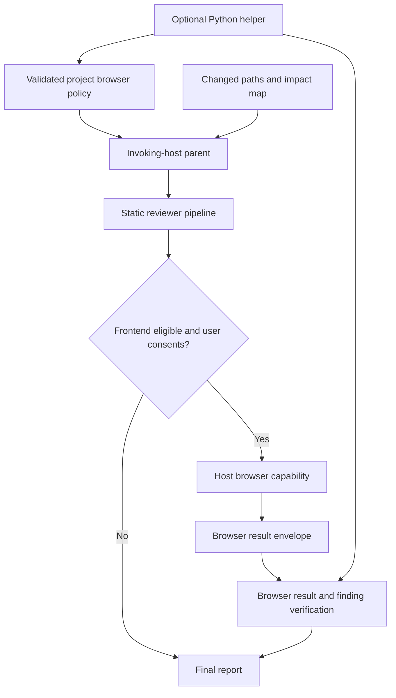
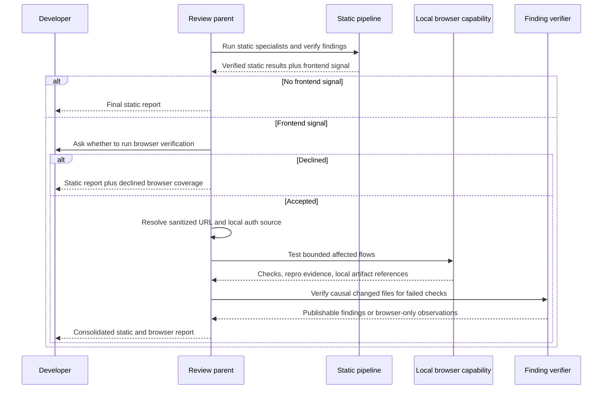
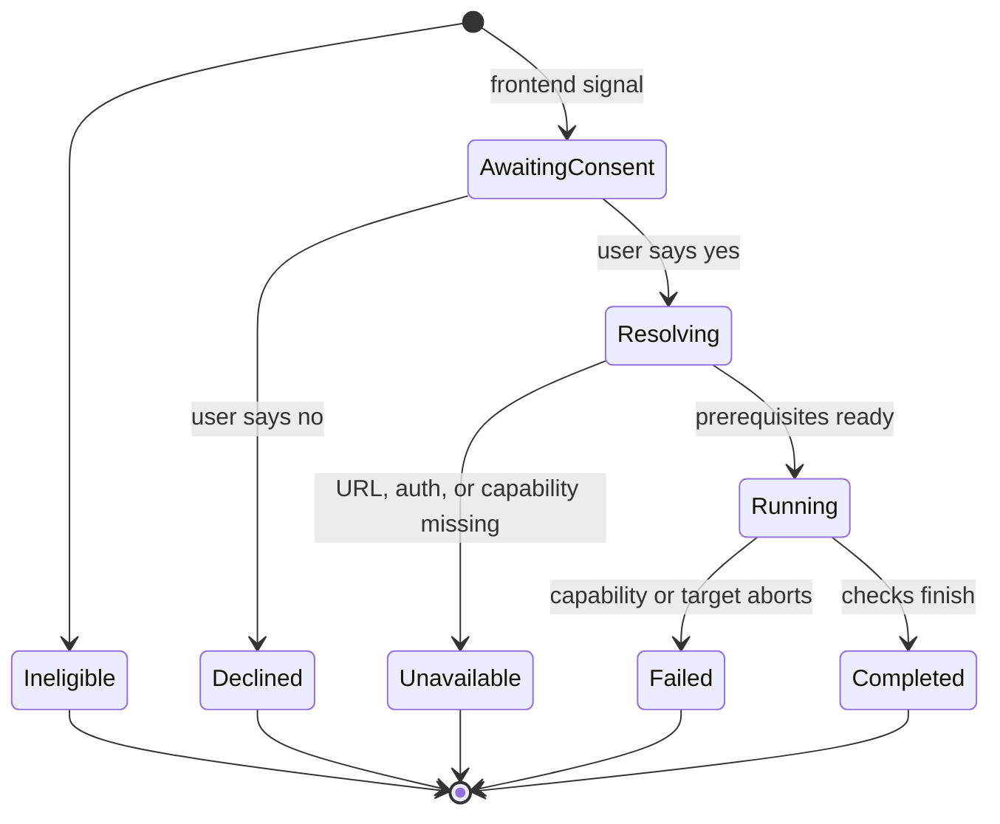

# Browser Verification for Frontend Reviews - Plan

## Goal Capsule

- **Objective:** Developers reviewing frontend changes can optionally validate affected authenticated UI flows in a real browser and receive reproducible runtime evidence without losing the static review when browser coverage cannot run.
- **Means:** Add a host-capability browser-verification phase, deterministic configuration/result contracts, and explicit browser coverage in the final report (KTD1-KTD6).
- **Product authority:** The developer decides per eligible review whether browser verification runs; project configuration may supply safe defaults but cannot grant consent.
- **Open blockers:** None.
- **Execution profile:** Standard, security-sensitive extension of the cross-host review workflow.
- **Stop conditions:** Stop browser execution and preserve the static review if consent is declined, no browser capability is exposed, the URL is absent or invalid, authentication cannot be obtained without exposing secrets, or the target is unreachable.
- **Tail ownership:** The executor owns code, tests, canonical-skill synchronization, package verification, and documentation. Commits, pushes, releases, and running browser checks against a real customer environment require separate user direction.

---

## Product Contract

### Summary

Review Agent will recognize frontend-bearing changes, finish its normal static specialist work, and then ask once: “Frontend changes detected. Run browser verification?” An accepted run uses the invoking host's existing browser or browser-test capability, resolves a reachable project URL and local authentication source, tests only affected flows, and adds browser checks, failures, reproduction steps, and local failure screenshots to the consolidated report.

Browser verification is an optional pipeline component, not a 13th reviewer role and not a bundled test framework. Non-frontend reviews do not prompt. Declined, unavailable, failed, or unauthenticated browser execution never discards verified static findings.

### Problem Frame

The current pipeline can reason about UI code through `frontend-accessibility`, correctness, testing, and impact mapping, but it cannot observe the rendered application. This leaves a material gap for layout, interaction, routing, focus, modal, responsive, and login-dependent regressions that only appear at runtime.

Hardwiring Playwright or Compound Engineering into the Python package would weaken the product's central portability promise. Codex, Claude Code, Kiro, Cursor, and future Agent Skills hosts expose different browser capabilities, while some expose none. The product therefore needs one portable behavior contract with truthful capability reporting rather than one mandatory browser runtime.

### Key Decisions

- KD1. **Browser verification is opt-in and frontend-triggered.** (session-settled: user-directed — chosen over automatic browser execution on every review: the user wants an explicit question only when frontend changes are present.) Governs R1-R4.
- KD2. **URL and authentication are resolved locally after consent.** (session-settled: user-directed — chosen over anonymous or configuration-free browser assumptions: the user's projects require a URL and login credentials.) Governs R5-R10.
- KD3. **Browser verification is a pipeline component, not another selectable agent.** (session-settled: user-approved — chosen over expanding the reviewer roster: runtime evidence has a different lifecycle and trust contract from static specialist opinion.) Governs R11-R16.
- KD4. **The first release covers browser verification only.** (session-settled: user-directed — chosen over a broader runtime-verification framework: browser testing is the immediate production need.) Governs R17-R18 and the scope boundaries.

### Requirements

**Eligibility and consent**

- R1. The existing deterministic `frontend-accessibility` risk signal is the canonical eligibility signal for browser verification.
- R2. When R1 is present, the parent completes static specialist collection and static finding verification before asking once whether to run browser verification; when configuration supplies a URL, the question names its sanitized target origin and path.
- R3. When R1 is absent, the parent neither asks about browser verification nor invents missing browser coverage.
- R4. Declining the prompt ends browser work and returns the normal static report with browser coverage labeled `declined`.

**URL and authentication**

- R5. After consent, the parent obtains the base URL from validated project configuration or asks for it when absent; only `http` and `https` targets are accepted.
- R6. URL validation rejects embedded user information, displays the sanitized target before navigation, and prevents query strings or fragments from appearing in logs, reports, or external assignments.
- R7. Authentication preference is an already-authenticated local browser session, then configured credential environment variables whose names the parent displays and the user explicitly approves before they are read, then a user-performed interactive sign-in in the local browser.
- R8. Project configuration may store a base URL, an optional login URL, and credential environment-variable names restricted to a dedicated `REVIEW_AGENT_BROWSER_` prefix, but never credential values, cookies, tokens, or browser storage state.
- R9. Secret values must not enter Git context, reviewer assignments, external adapters, result JSON, reports, logs, screenshots of the login form, or repository files.
- R10. If authentication is missing or fails, the parent asks for a secure local source or interactive sign-in rather than requesting raw credentials in chat; password entry, SSO consent, MFA, CAPTCHA, and browser permission dialogs remain human-only, and unresolved authentication becomes truthful unavailable coverage.

**Browser execution and evidence**

- R11. The invoking host remains the browser-execution parent and may use an already-exposed review-only browser skill, browser tool, or browser-test capability; it must not probe or invoke another installed agent host, edit code, fix findings, suppress a host permission prompt, or grant itself broader browser permissions.
- R12. The browser phase tests a bounded set of affected flows derived from changed frontend paths, routes, impact-map relationships, and verified static findings rather than crawling the whole product.
- R13. Browser actions in this release are non-destructive. A flow that would create, update, delete, purchase, send, publish, or otherwise mutate meaningful data is skipped rather than authorized by repository policy or configuration.
- R14. Each attempted check records a concise name, sanitized route, reproduction steps, expected behavior, observed behavior, pass/fail/skip status, and evidence.
- R15. Failed affected-flow checks capture a host-local screenshot only when the page is safe to record; login screens, credential fields, tokens, cookies, videos, and full traces are excluded, and the report references rather than uploads the artifact.
- R16. Browser observations become code-review findings only after the parent maps the failure to a changed root-cause file and passes the existing finding-verifier gate. Unmapped failures remain browser observations, not speculative code findings.

**Coverage and portability**

- R17. Browser execution status is represented independently from reviewer roles as `declined`, `unavailable`, `failed`, or `completed`; completed runs contain passed, failed, or skipped checks.
- R18. Browser unavailability, target failure, tool failure, or authentication failure preserves every successful static result and appears as a browser limitation without changing the static execution-mode label.
- R19. Review Agent remains usable as a skill without the Python helper. When the helper is installed, it deterministically validates browser policy/result envelopes and renders coverage but does not launch a browser or add a runtime browser dependency.
- R20. The canonical skill bundle and marketplace mirrors define identical browser behavior across Codex, Claude Code, Kiro, Cursor, and other Agent Skills-compatible hosts, while labeling actual host capability rather than promised capability.

### Key Flows

- F1. Eligible review accepted
  - **Trigger:** Static review has completed and the change carries `frontend-accessibility`.
  - **Actors:** Developer, invoking-host parent, local browser capability.
  - **Steps:** Ask once; resolve URL; resolve existing-session, environment, or interactive authentication; derive affected checks; execute safely; verify browser failures; synthesize one report.
  - **Outcome:** Static and browser evidence appear together with separate coverage provenance.
- F2. Eligible review declined
  - **Trigger:** The developer answers no to the browser prompt.
  - **Steps:** Record `declined`; perform no URL, credential, browser, or project-command work; finalize static results.
  - **Outcome:** The review completes without browser execution.
- F3. Accepted but unavailable
  - **Trigger:** Consent is granted, but URL, authentication, target availability, or browser capability cannot be established.
  - **Steps:** Stop the browser phase, redact the failure, and finalize static results.
  - **Outcome:** Browser coverage is truthful and incomplete; static coverage is unchanged.

### Acceptance Examples

- AE1. Given a `.tsx`, `.vue`, `.html`, or `.css` change triggers `frontend-accessibility`, when static review completes, then the parent asks once whether to run browser verification.
- AE2. Given only backend or documentation changes, when review runs, then no browser prompt or browser coverage warning appears.
- AE3. Given an eligible change and a declined prompt, when the report is finalized, then static findings remain and browser status is `declined` with no URL or auth resolution attempted.
- AE4. Given consent, a configured staging URL, and an already-authenticated local browser, when affected flows are reachable, then checks execute without reading credential environment variables.
- AE5. Given consent and a signed-out browser, when configured username/password environment variables exist, then the host may authenticate locally and no secret value appears in generated context, logs, results, reports, or artifacts.
- AE6. Given consent and missing authentication sources, when the user does not complete interactive sign-in, then browser coverage is `unavailable` and the static report remains valid.
- AE7. Given consent but no host browser capability, when the phase is reached, then the report names unavailable browser coverage without attempting another installed agent or adding a dependency.
- AE8. Given a failed affected UI check, when the parent verifies a causal changed file, then the final finding includes browser reproduction evidence; when causality cannot be verified, the failure stays in the browser section only.
- AE9. Given a URL containing a query or fragment and a failing login, when output is rendered, then the report contains only a sanitized URL and no login-form screenshot.
- AE10. Given an affected flow that would mutate meaningful data, when browser verification maps the flow, then the check is skipped and the limitation is reported.

### Success Criteria

- Frontend changes produce exactly one runtime-consent decision and non-frontend changes produce none.
- Every accepted browser run ends in an explicit coverage state without suppressing static findings.
- Automated tests demonstrate that credential values, cookies, storage state, and sensitive URL components cannot enter structured or rendered outputs, while contract tests prohibit login-page capture and automatic artifact upload.
- The package retains zero mandatory runtime dependencies and the same canonical skill bundle serves every supported host.

### Scope Boundaries

In scope:

- Frontend-triggered consent, URL/auth resolution, host capability selection, bounded affected-flow checks, local failure screenshots, browser result validation, final-report integration, cross-host skill guidance, tests, and documentation.

Outside this release:

- A 13th browser reviewer role, automatic browser execution, a bundled Playwright/Selenium runtime, calling another agent host to drive its browser, whole-product exploratory dogfooding, production monitoring, CI-scheduled browser runs, API/CLI/mobile runtime verification, and a hosted dashboard.
- Starting or stopping the target application. The first release requires a reachable URL and does not introduce arbitrary project start commands.
- Destructive or business-state-mutating flows. A later release may add a separate, explicit safe-environment consent contract.

### Sources / Research

- Existing control-plane and pipeline contracts: `src/review_agent/skill_template/review-agent/SKILL.md`, `src/review_agent/skill_template/review-agent/references/reviewer-contract.md`, and `docs/how-it-works.md`.
- Existing eligibility and result seams: `src/review_agent/planning.py`, `src/review_agent/models.py`, `src/review_agent/cli.py`, and `src/review_agent/review.py`.
- [Agent Skills specification](https://agentskills.io/specification): skills are portable instruction bundles, while tool pre-approval remains experimental and varies by implementation; this supports capability-aware host instructions instead of a hardwired tool dependency.
- [Playwright authentication guidance](https://playwright.dev/docs/auth): authenticated state can contain impersonation-capable cookies and headers and should not be committed; this directly shapes R8-R10 and KTD5.
- [Playwright recording options](https://playwright.dev/docs/test-use-options): screenshots and traces are optional artifacts; this supports failure-only screenshots and no default trace/video capture.

---

## Planning Contract

### Key Technical Decisions

- KTD1. **Use a host-capability protocol, not a bundled browser runner.** (session-settled: user-approved — chosen over hardwiring `/ce-test-browser` or Playwright into the package: one behavioral contract must work in Codex, Claude Code, Kiro, Cursor, and future hosts.) The skill names required behavior and evidence; each host uses only browser capabilities already exposed in the invoking session. Governs R11, R19-R20.
- KTD2. **Insert browser verification after static verification and before final synthesis.** (session-settled: user-approved — chosen over running it as a parallel specialist: consent, authentication, and runtime side effects require a parent-owned sequential gate.) Static findings are verified first; verified browser-caused findings then re-enter finding verification, deduplication, and severity calibration. Governs R2, R12, R16.
- KTD3. **Keep browser coverage separate from `ReviewerRun`.** Browser execution has no reviewer role, context-independence claim, or corroboration semantics. Add dedicated browser policy, run, check, artifact, and status models as an optional field on the review result. Governs R14, R17-R18.
- KTD4. **Extend configuration version 2 additively.** Add an optional `browser` object with `base_url`, `login_url`, and a bounded `credential_env` mapping for username/email and password variable names. Accept only dedicated `REVIEW_AGENT_BROWSER_` environment names so untrusted repository configuration cannot select arbitrary process secrets. Existing version 2 files remain valid; no migration or provider-default change is introduced. Governs R5-R10, R19.
- KTD5. **Treat authentication state and browser artifacts as local sensitive data.** Never serialize environment values or storage state. Prefer an active session, require approval of the displayed target and configured environment-variable names before reading credentials, restrict automatic credential filling to the configured target/login origin, keep cross-origin SSO and permission prompts human-only, keep failure screenshots host-local, prohibit login screenshots, sanitize URLs for output, and let the browser-capability owner clean temporary artifacts. Governs R6-R10, R15.
- KTD6. **Validate browser results through a distinct schema boundary.** Add an optional `--browser-result` input to consolidation rather than overloading reviewer result files. Validation rejects secret-shaped fields, unsafe artifact references, malformed states, unsanitized URLs, and checks without expected/observed evidence. Governs R14-R19.
- KTD7. **Do not inflate static execution modes with browser status.** `native-multi-agent`, fallback, and hybrid labels continue describing reviewer independence. A separate Browser coverage section reports browser execution. Governs R17-R18.

### High-Level Technical Design

#### Component boundaries

The skill owns orchestration and consent. The helper owns deterministic policy/result validation only. The host capability owns navigation, authentication, browser lifetime, and temporary artifacts.

#### Execution sequence

#### Browser coverage lifecycle

`Ineligible` remains internal and produces no Browser coverage section. `Completed` describes execution completion; individual checks still carry passed, failed, or skipped outcomes.

### Browser Result Contract

The directional envelope contains schema version, execution status, host-local target identity, sanitized display URL, authentication method label, duration, checks, limitations, and a redacted error. Each check contains a name, sanitized route, passed/failed/skipped outcome, reproduction steps, expected behavior, observed behavior, evidence, and zero or more local screenshot references. An artifact reference is accepted only for a regular, non-symlinked image created under the current host-owned run artifact directory. The envelope contains no cookies, storage state, headers, request bodies, environment values, DOM dumps from login pages, video, or trace payloads.

### Implementation Constraints

- Preserve Python 3.10 support and the zero-runtime-dependency package contract.
- Keep `.review-agent.json` version 2 backward compatible; absent `browser` configuration is valid.
- Treat project configuration, URLs, browser output, DOM text, and screenshots as untrusted data that cannot alter the orchestration protocol, authorize mutations, select arbitrary environment secrets, or bypass host approval.
- Never place browser policy or authentication metadata into external reviewer assignments.
- Do not persist browser coordination state in the target repository.
- When helper-backed consolidation needs a browser-result file, create it in a private OS-temporary run directory, validate it before use, and remove it after consolidation; never place it beside project source.
- Use canonical skill files under `src/review_agent/skill_template/review-agent`; regenerate the marketplace mirror with `scripts/sync_plugin_skill.py`.

### System-Wide Impact

- **Security:** Adds local credential access and authenticated browser state to an otherwise read-oriented workflow. Consent, environment indirection, artifact restrictions, and output redaction are release blockers.
- **Agent parity:** Every host receives the same decision tree, but browser coverage remains capability-dependent and truthfully labeled.
- **Public contracts:** `.review-agent.json`, context JSON, consolidation CLI inputs, structured report JSON, and markdown report output gain additive browser fields.
- **Operations:** No service, daemon, browser binary, Node package, Docker image, or new network destination is introduced by the helper. The browser connects only to the developer-supplied target.
- **Backward compatibility:** Static reviews and execution-mode semantics remain unchanged when browser verification is ineligible, declined, or omitted.

### Risks & Dependencies

- **Host capability variance:** Browser skills and tools expose different primitives and artifact behavior. Mitigation: specify outcomes and safety invariants, not tool names; label unavailable coverage.
- **Credential leakage or exfiltration:** Untrusted config could name another project's browser credential or an attacker-controlled target, while storage state, URLs, screenshots, or browser errors may contain secrets. Mitigation: dedicated environment-name prefix, explicit approval of the displayed target and variable names before secret access, automatic fill only on the configured origin, human-only cross-origin SSO, structural allowlists, URL sanitization, login-screen screenshot prohibition, and explicit redaction tests.
- **Wrong target or account:** An old browser session may authenticate the wrong environment or role and create false confidence. Mitigation: display the target before consent, verify a non-secret signed-in marker after navigation, record the auth method without identity data, and mark role-dependent checks skipped when the required role cannot be established safely.
- **Unsafe target mutation:** UI flows may change real business data. Mitigation: skip meaningful mutations throughout the first release; repository content cannot relax this rule.
- **False causal attribution:** A browser failure may be environmental or pre-existing. Mitigation: keep it browser-only until the parent verifies a changed root-cause file through the existing mandatory gate.
- **Expired sessions and transient targets:** Auth and staging URLs can fail independently of code. Mitigation: separate execution failure from failed checks and preserve static findings.
- **Over-broad frontend selection:** Styling or generated assets may trigger browser eligibility without a meaningful route. Mitigation: ask once, derive a bounded flow list, and allow a completed run with skipped/no applicable checks rather than inventing coverage.

---

## Implementation Units

### U1. Add browser policy and result domain contracts

- **Goal:** Introduce a dedicated, secret-safe model and validation boundary without changing reviewer-role semantics.
- **Requirements:** R5-R10, R14-R19; KTD3-KTD7.
- **Dependencies:** None.
- **Files:** `src/review_agent/models.py`, `src/review_agent/browser.py`, `tests/test_models.py`, `tests/test_browser.py`.
- **Approach:**
  1. Add browser policy, execution status, authentication method, check outcome, artifact reference, check result, and run result models outside `ReviewerRole` and `ReviewerRun`.
  2. Create deterministic parsing and validation in `browser.py`, including URL sanitization, dedicated credential-environment-name prefixes, secret-shaped field rejection, bounded text/list sizes, and safe local artifact-reference handling.
  3. Keep completed execution distinct from per-check outcomes and keep browser observations distinct from code findings.
- **Patterns to follow:** Enum/dataclass serialization in `src/review_agent/models.py`; strict mapping parsers and path normalization in `src/review_agent/review.py`; redaction boundaries in `src/review_agent/external.py`.
- **Test scenarios:**
  - A complete browser envelope with passed, failed, and skipped checks round-trips without acquiring reviewer-role or corroboration semantics.
  - Each lifecycle status accepts only its valid fields and rejects contradictory states, such as `declined` with executed checks.
  - URLs with credentials are rejected; URL query and fragment data are removed from display output.
  - Envelopes containing password, cookie, authorization header, storage-state, token, or raw environment-value fields are rejected or redacted before serialization; config attempting to name a non-`REVIEW_AGENT_BROWSER_` process secret fails validation.
  - Login-page screenshot references, symlinks, non-images, and paths outside the current run artifact directory are rejected; safe failed-check screenshots remain referencable.
- **Verification:** Browser models serialize deterministically, invalid or secret-bearing envelopes fail closed, and existing reviewer model tests remain unchanged.

### U2. Extend project config, context, and consolidation additively

- **Goal:** Let the optional helper expose browser eligibility/policy and validate one browser result while retaining configuration version 2 and existing static CLI behavior.
- **Requirements:** R1, R5-R10, R17-R20; KTD4-KTD7.
- **Dependencies:** U1.
- **Files:** `src/review_agent/cli.py`, `src/review_agent/planning.py`, `src/review_agent/review.py`, `tests/test_cli.py`, `tests/test_planning.py`, `tests/test_review.py`.
- **Approach:**
  1. Reuse `frontend-accessibility` as eligibility; expose a secret-free browser policy descriptor in plan/context JSON without adding a second detection system.
  2. Validate optional `browser.base_url`, `browser.login_url`, and allowed credential environment-variable names while keeping absent browser config valid and retaining version 2.
  3. Add optional `consolidate --browser-result` parsing and an optional browser field on `ReviewResult`; do not accept browser data through reviewer `--result` inputs.
  4. Render a Browser coverage section only for `declined`, `unavailable`, `failed`, or `completed` runs. Keep no section for ineligible changes and preserve current execution modes.
  5. Keep browser policy out of reviewer assignments and external adapter payloads.
- **Patterns to follow:** `DEFAULT_CONFIG`/`load_config`, `_context_document`, `_plan_from_document`, `consolidate`, `render_markdown`, and `render_json`.
- **Test scenarios:**
  - Covers AE1 / AE2. Frontend changes expose eligible browser metadata; backend/documentation changes do not.
  - An existing version 2 configuration without `browser` loads unchanged and produces the same static plan/report.
  - A version 2 browser config containing URL plus environment-variable names loads, while literal credential-value keys and invalid URL schemes fail with clean errors.
  - Covers AE3. A declined browser result renders separate coverage without changing or removing static findings.
  - Covers AE7. An unavailable browser result renders a limitation while the static execution mode and findings remain intact.
  - Covers AE8. Browser-only observations do not appear in the code Findings section unless represented by an independently verified changed-file finding.
  - Covers AE9. Markdown and JSON output contain no query, fragment, credential value, cookie, token, or storage state.
- **Verification:** Existing CLI invocations and version 2 fixtures remain compatible; browser-aware context and reports are deterministic and secret-free.

### U3. Define the portable browser-verification control-plane protocol

- **Goal:** Make every supported host follow the same prompt, capability, authentication, safety, evidence, and fallback behavior.
- **Requirements:** R2-R16, R18-R20; KTD1-KTD2, KTD5.
- **Dependencies:** U1-U2.
- **Files:** `src/review_agent/skill_template/review-agent/SKILL.md`, `src/review_agent/skill_template/review-agent/references/browser-verification.md`, `src/review_agent/skill_template/review-agent/references/host-capabilities.md`, `src/review_agent/skill_template/review-agent/references/reviewer-contract.md`, `tests/test_skills.py`.
- **Approach:**
  1. Link one new one-level browser reference from `SKILL.md` and insert the browser phase after static finding verification but before final synthesis.
  2. Specify the exact one-question consent gate with the sanitized configured target when available, then one-at-a-time URL/auth resolution only after acceptance.
  3. Define capability selection by outcomes: use an already-exposed review-only host browser/test skill or tool, prefer an authenticated session, otherwise display and obtain approval for dedicated configured environment names before reading their values or use interactive sign-in, preserve all host approval dialogs, and never call another host.
  4. Bound flow derivation to changed paths, routes, impact relationships, and static findings; prohibit whole-app exploration and meaningful data mutation in this release.
  5. Define the browser result envelope, failure-only screenshot policy, secret handling, causal verification, and truthful coverage states.
- **Patterns to follow:** Existing progressive disclosure and one-level references; `host-capabilities.md` for truthful runtime capability; `reviewer-contract.md` for the parent-owned mandatory pipeline.
- **Test scenarios:**
  - Covers AE1. The canonical workflow orders static verification, one consent prompt, optional browser work, browser-causal verification, and final synthesis.
  - Covers AE3. Decline explicitly prevents URL, auth, browser, and project-command work.
  - Covers AE4 / AE5. Existing-session auth precedes environment auth; the displayed target and environment names are approved before secret access, automated filling stays on the configured origin, and secret values remain local to the browser executor.
  - Covers AE6 / AE7. Missing auth or browser capability produces unavailable coverage and preserves static review.
  - Covers AE10. The protocol skips unapproved mutating flows and records the reason.
  - Host capability guidance mentions portable outcomes and examples such as host browser tools or `/ce-test-browser` without making any named extension mandatory.
- **Verification:** Contract tests pin the ordering, consent language, no-other-host rule, auth precedence, secret prohibitions, safe-action default, and separate coverage semantics.

### U4. Add end-to-end acceptance coverage and distribution documentation

- **Goal:** Prove the feature's cross-host behavior, keep the canonical/plugin bundles identical, and document secure configuration and use.
- **Requirements:** R1-R20 and AE1-AE10.
- **Dependencies:** U1-U3.
- **Files:** `tests/test_acceptance.py`, `tests/test_plugins.py`, `scripts/sync_plugin_skill.py`, `README.md`, `docs/how-it-works.md`, `plugins/review-agent/skills/review-agent/SKILL.md`, `plugins/review-agent/skills/review-agent/references/browser-verification.md`, `plugins/review-agent/skills/review-agent/references/host-capabilities.md`, `plugins/review-agent/skills/review-agent/references/reviewer-contract.md`, `src/review_agent/__init__.py`, `pyproject.toml`, `plugins/review-agent/.codex-plugin/plugin.json`, `plugins/review-agent/.claude-plugin/plugin.json`.
- **Approach:**
  1. Extend the fake-host acceptance harness with browser eligibility, consent, capability, authentication-source, run, and failure outcomes while preserving current native/external reviewer assertions.
  2. Add security acceptance assertions over every serialized and rendered artifact using sentinel secret values.
  3. Document the prompt flow, supported auth sources, optional configuration, safe environment expectations, browser coverage states, host variability, and failure behavior.
  4. Synchronize the canonical skill into the marketplace bundle and keep distribution/version metadata aligned for the release.
- **Execution note:** Prefer behavioral acceptance fixtures and install/runtime smoke verification; no real customer URL or credential is required in automated tests.
- **Test scenarios:**
  - Covers AE1-AE3. Fake frontend/backend reviews prove exact prompt/no-prompt/decline behavior.
  - Covers AE4-AE7. Fake existing-session, environment-auth, missing-auth, and missing-capability runs prove precedence and fallback.
  - Covers AE8-AE10. Fake failed, unmapped, sanitized-URL, and unsafe-mutation flows prove reporting boundaries.
  - Canonical and plugin skill trees remain byte-identical and include the new reference for Codex and Claude packaging.
  - A built wheel installs with no new runtime dependency, exposes the current version, and installs the full skill bundle on the legacy Python/pip path.
- **Verification:** The complete unit/acceptance suite, sync check, modern wheel build, and legacy-package CI job pass; README and how-it-works examples match the implemented schema and workflow.

---

## Verification Contract

| Gate | Command or evidence | Covers | Passing signal |
|---|---|---|---|
| Focused domain/config tests | `python -m unittest tests.test_browser tests.test_models tests.test_planning tests.test_cli tests.test_review -v` | U1-U2 | Browser policy/results validate securely and existing static contracts remain compatible. |
| Skill and behavior tests | `python -m unittest tests.test_skills tests.test_acceptance -v` | U3-U4 | Prompt ordering, host portability, auth safety, coverage fallback, and acceptance examples pass. |
| Full regression suite | `python -m unittest discover -s tests -v` | U1-U4 | No existing native, fallback, external, impact, packaging, or report behavior regresses. |
| Marketplace synchronization | `python scripts/sync_plugin_skill.py --check` | U3-U4 | Canonical and plugin skill bundles are byte-identical. |
| Package smoke | `python -m pip wheel . --no-deps --wheel-dir dist` plus CI's legacy-package job | U4 | The wheel has no new dependency and still installs under the supported legacy packaging path. |
| Behavioral host smoke | Invoke the installed skill once on a fake frontend change with browser capability and once without it | U3-U4 | Both runs ask once; the capable run produces browser checks and the incapable run preserves static results with truthful coverage. |
| Secret-leak audit | Search test outputs/artifacts for configured sentinel credentials, tokenized URL parts, cookie values, and storage-state markers | U1-U4 | Zero sentinel secret matches outside the local browser executor fixture. |

Real browser smoke testing uses a non-production or explicitly safe target, a dedicated test account, and non-destructive flows. It is a release confidence check, not an automated CI dependency.

---

## Definition of Done

- R1-R20 and AE1-AE10 are implemented and covered by the Verification Contract.
- U1 is done when browser policy/run contracts are distinct from reviewer roles, lifecycle validation is deterministic, and secret-bearing envelopes fail closed.
- U2 is done when existing version 2 config and static CLI behavior remain compatible, optional browser config/result inputs work, and reports separate static mode from browser coverage.
- U3 is done when the canonical skill asks exactly once after eligible static review, displays the configured target and any credential environment names before access, uses only review-only current-host browser capabilities without bypassing approval, resolves auth locally from dedicated sources, avoids code edits and meaningful mutations, and preserves static results on every failure path.
- U4 is done when acceptance, security, sync, wheel, and legacy packaging gates pass and user documentation explains secure setup and real behavior.
- No credentials, cookies, storage state, signed URL components, or login screenshots are committed, persisted in repository coordination state, placed in external assignments, or rendered in outputs.
- The package keeps Python 3.10 support and zero mandatory runtime dependencies.
- Abandoned browser-runner, generic-runtime-verifier, or test-framework experiments are absent from the final diff.
